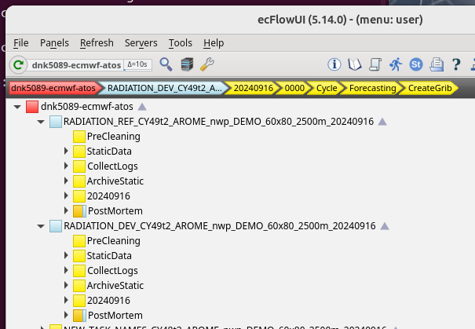
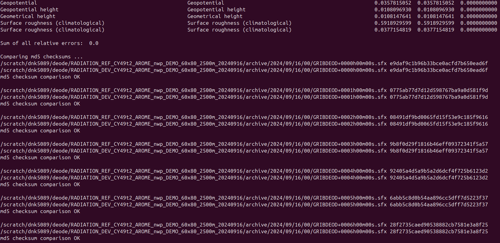

```
ecinteractive -c 32 -m 32G -s 60G
ec_restore_local_ssd -r
cd $LOCALSSD
cd build/IAL-DEODE
 ./compile-oli.sh 

cd dev/IAL-DEODE
git commit -a -m "removed acnebr, aplpar and ec_phys related modifications to model:ydmodel, enabling ydmodel to be input instead of in-output to mf_raddrv"

cd dev/reduced_grid_radiation/
source ~/.venv/python3.11.10/bin/activate
python compare_radiation_results.py 
./compare_radiation_results_md5sum.sh 


 cd dev/Deode-Workflow/
 sbatch Forecast_radiation_dev.job
```

```
 #!/bin/bash
#SBATCH --job-name=test-threaded
#SBATCH --qos=np
#SBATCH --time=4:30:00
#SBATCH --cpus-per-task=128
#SBATCH --output=ial-deode_build.log
#SBATCH --error=ial-deode_build.log

export FP_PRECISION=double

export INSTALL_DIR=/perm/dnk5089/install/IAL-DEODE/dev-cy49t2-v1.0.0-radiation
export EXT_INSTALLDIR=$INSTALL_DIR
export IAL_DIR=/home/dnk5089/dev/IAL-DEODE

export BUILD_DIR=/etc/ecmwf/ssd/ssd1/ecinteractive/dnk5089-ecinteractive/build/IAL-DEODE/build
export BUILD_DIR_EXT=/etc/ecmwf/ssd/ssd1/ecinteractive/dnk5089-ecinteractive/build/IAL-DEODE/build_ext

#export BUILD_DIR=$SCRATCH/build/IAL-DEODE/dev-cy49t2-v1.0.0-radiation/build
#export BUILD_DIR_EXT=$SCRATCH/build/IAL-DEODE/dev-cy49t2-v1.0.0-radiation/build_ext

 
#export BUILD_DIR=/hpcperm/dnk5089/build/IAL-DEODE/dev-cy49t2-v1.0.0-radiation/build
#export BUILD_DIR_EXT=/hpcperm/dnk5089/build/IAL-DEODE/dev-cy49t2-v1.0.0-radiation/build_ext

    

export FP_PRECISION=double

source $IAL_DIR/cmake/config/atos_setenv_intel


# build external libraries (fiat ectrans field_api)
#cmake -S $IAL_DIR/external -DCMAKE_INSTALL_PREFIX=$INSTALL_DIR -DCMAKE_C_COMPILER=mpicc -DCMAKE_Fortran_COMPILER=$IAL_DIR/cmake/mpifort_wrapper -B $BUILD_DIR_EXT
#cmake --build $BUILD_DIR_EXT -j 128
#cmake --install $BUILD_DIR_EXT

export SURFEX_OFFLINE_BINARIES="yes"


#export FFLAGS="-check all"
#cmake --build . --target help

#cmake -DCMAKE_BUILD_TYPE=RelWithDebInfo -S $IAL_DIR -DCMAKE_INSTALL_PREFIX=$INSTALL_DIR -DCMAKE_C_COMPILER=mpicc -DCMAKE_Fortran_COMPILER=$IAL_DIR/cmake/mpifort_wrapper  -DCMAKE_Fortran_FLAGS="-check all" -DFFLAGS="-check all" -B $BUILD_DIR
cmake --build  $BUILD_DIR -j 128 # --verbose
#cmake --build  $BUILD_DIR --target arpifsdev-static -j 128 # --verbose
#cmake --build  $BUILD_DIR --target MASTERODB -j 128 # --verbose
if [ $? -ne 0 ]; then
    echo "[compile-oli.sh] Error: CMake configuration failed!"
    exit 1
fi

cmake --install $BUILD_DIR
```


# Reduced grid radiation development

This is how I set up and run my Deode-Workflow reference and development cases.

The path for ```Deode-Workflow``` repository is ```$DEODE_WORKFLOW```
and the path for ```reduced_grid_radiation``` is ```$REDUCED_GRID_RADIATION``` 

In my setup these are:
```
echo $REDUCED_GRID_RADIATION
/home/dnk5089/dev/reduced_grid_radiation

echo $DEODE_WORKFLOW
/home/dnk5089/dev/Deode-Workflow
```

## Create the reference and development deode workflow cases and run them in ecflow 
First change the binary paths for the reference and development Deode-Workflow configurations.

In the file ```$REDUCED_GRID_RADIATION/deode-workflow/radiation_dev_cy49t2/configuration_modification.toml``` change the binary directory to the path for your development binary: 
```
[submission]
  bindir = "/perm/dnk5089/install/IAL-DEODE/dev-cy49t2-v1.0.0-radiation/bin"
```

Likewise for the reference binary, in the file ```$REDUCED_GRID_RADIATION/deode-workflow/radiation_ref_cy49t2/configuration_modification.toml``` change the binary directory to the path for your reference binary: 
```
[submission]
  bindir = "/perm/dnk5089/install/IAL-DEODE/ref-cy49t2-v1.0.0-radiation/bin"
```

Now you can create the reference and development cases and start the ecflow suites:
```
cd $DEODE_WORKFLOW

deode case ?deode/data/config_files/configurations/cy49t2_arome $REDUCED_GRID_RADIATION/deode-workflow/radiation_ref_cy49t2/configuration_modification.toml -o $REDUCED_GRID_RADIATION/deode-workflow/radiation_ref_cy49t2/configuration_generated.toml --start-suite

deode case ?deode/data/config_files/configurations/cy49t2_arome $REDUCED_GRID_RADIATION/deode-workflow/radiation_dev_cy49t2/configuration_modification.toml -o $REDUCED_GRID_RADIATION/deode-workflow/radiation_dev_cy49t2/configuration_generated.toml --start-suite
```

Open ecflow to check that the suites are running. 
To be able to rerun the forecast and create grib files again we need to stop the ```PostMortem``` ecflow tast from running. Thats done by right clicking the ```PostMortem``` task in ecflow and click ```Suspend```.

Now your ecflow suites should look something like this:




## Compare reference and development results:
When both cases are done we can compare the results by running the python script ```compare_radiation_results.py```.

In ```compare_radiation_results.py``` change the these two lines your deode directories:

```
ref_dir = "/scratch/dnk5089/deode/RADIATION_REF_CY49t2_AROME_nwp_DEMO_60x80_2500m_20240916/archive/2024/09/16/00/"
dev_dir = "/scratch/dnk5089/deode/RADIATION_DEV_CY49t2_AROME_nwp_DEMO_60x80_2500m_20240916/archive/2024/09/16/00/"
```

And compare the results by running:

```
python compare_radiation_results.py
```

A successfull comparion gives an outpu like this:




## Rerun Deode-Workflow Forecast and CreateGrib


To rerun the development case after a code change and recompilation first create the slurm scripts for the Forcast and CreateGrib tasks:

```
cd $DEODE_WORKFLOW
poetry shell
deode run --task Forecast --config-file $REDUCED_GRID_RADIATION/deode-workflow/radiation_ref_cy49t2/configuration_generated.toml
deode run --task CreateGrib --config-file $REDUCED_GRID_RADIATION/deode-workflow/radiation_dev_cy49t2/configuration_generated.toml
```

Now run the forcast job and see the log file:

```
sbatch Forcast.job
tail -f Forcast.log
```

When its done, run the create grib job and see its log file:

```
sbatch CreateGrib.job
tail -f CreateGrib.log
````


And compare the output to the reference results again ...
